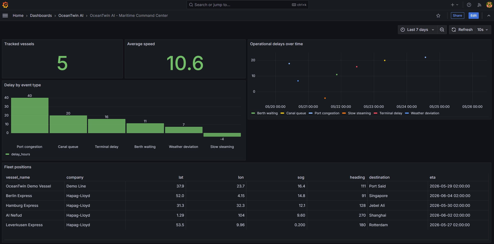
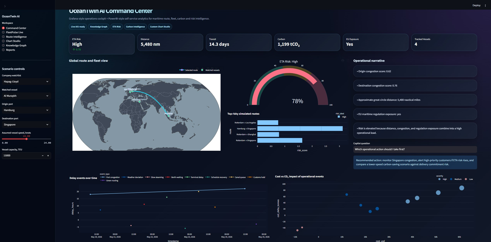
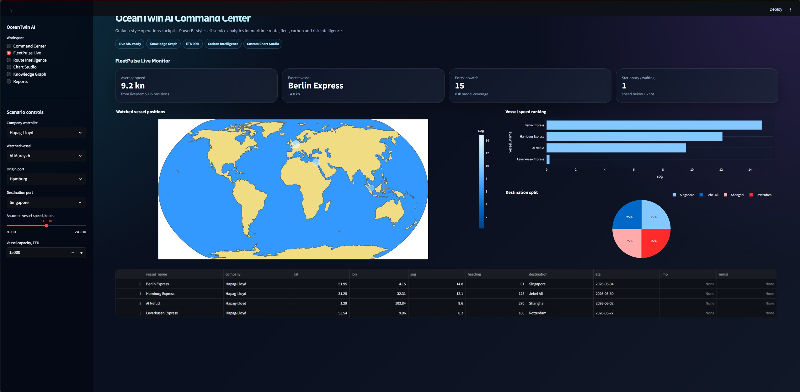
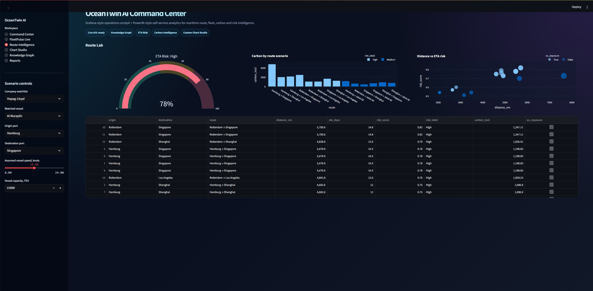
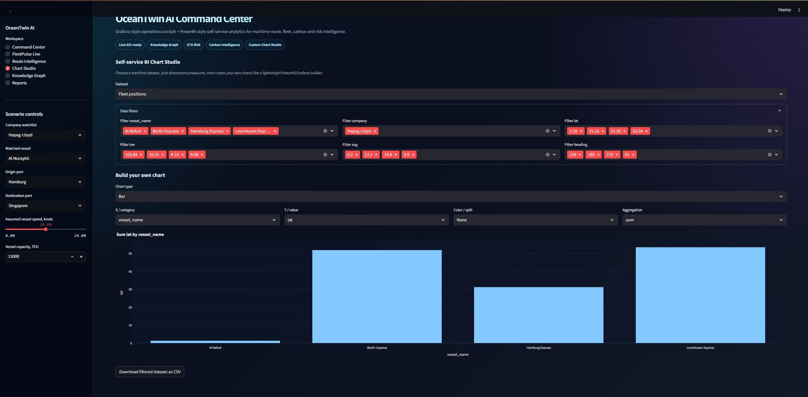
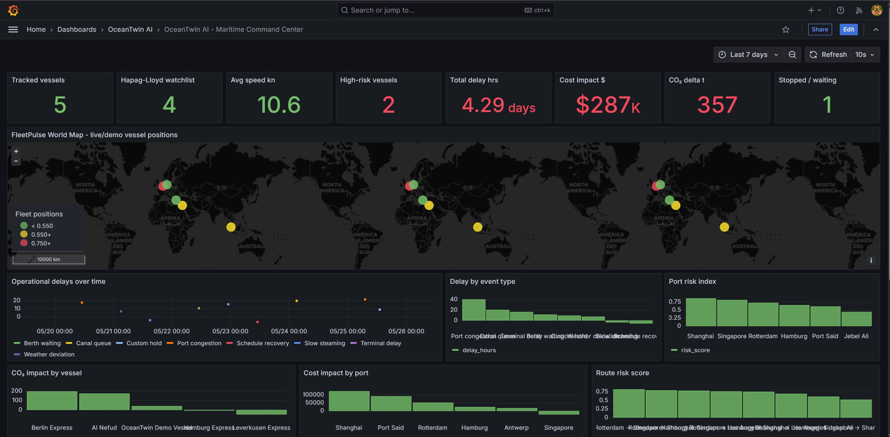
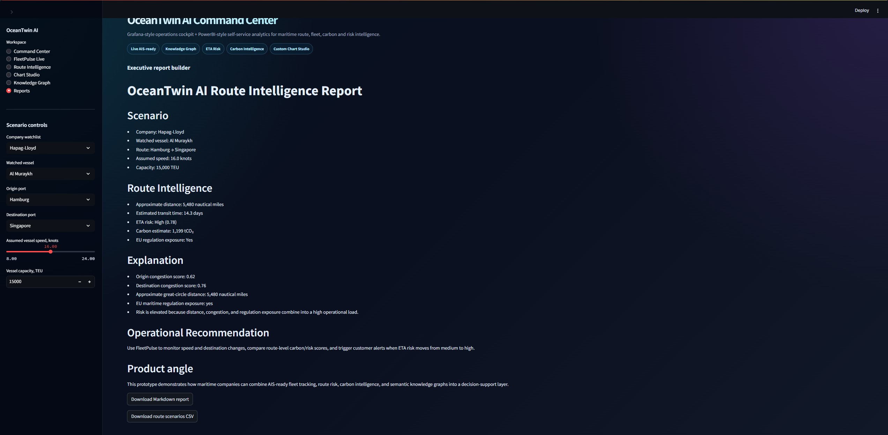

# OceanTwin AI — Maritime Command Center

**OceanTwin AI** is a maritime intelligence prototype that combines fleet monitoring, ETA risk scoring, route analytics, carbon intelligence, semantic knowledge graphs, and a Grafana-style operational dashboard.

The project was built as a portfolio-grade demonstration for maritime digitalization, liner-shipping operations, sustainability analytics, and AI-ready decision support.

> The goal is simple: turn vessel, port, route, carbon, and operational event data into a decision-support layer that feels like a real maritime startup product.

---

## Why this project matters

Modern container shipping is not only about moving vessels from port to port. It is about visibility, reliability, emissions, customer communication, and operational decision-making.

OceanTwin AI demonstrates how a maritime company could connect:

- live/demo fleet positions
- route and ETA risk
- port congestion indicators
- carbon impact
- operational delay events
- knowledge graph entities
- self-service business intelligence
- Grafana command center monitoring

This makes the project useful for roles in maritime technology, data engineering, research software engineering, knowledge graphs, operations analytics, and digital transformation.

---

## Screenshots

> Place your screenshots inside the `img/` folder using the filenames below.  
> If your images already have different names, either rename them or update the paths here.

### Grafana Maritime Command Center



The Grafana dashboard gives an operations-control-room view of the maritime system, including tracked vessels, average speed, high-risk vessels, delay hours, cost impact, CO₂ delta, waiting vessels, world map, port risk, event feed, route risk, and fleet position tables.

---

### Streamlit Command Center



The Streamlit command center provides a futuristic executive cockpit with route KPIs, ETA risk, carbon estimate, EU exposure, global route visualization, operational narrative, and AI-style recommendation panel.

---

### FleetPulse Live Monitor



FleetPulse shows watched vessel positions, speed ranking, destination split, and fleet table. It is designed to work with demo data now and AIS-streamed data later.

---

### Route Intelligence Lab



The route lab compares simulated maritime routes using ETA risk, distance, carbon impact, and EU exposure.

---

### Self-Service BI Chart Studio



The Chart Studio lets users choose datasets, filter columns, select dimensions and measures, and create charts without changing code.

---

### Semantic Knowledge Graph



The knowledge graph page represents the maritime route as semantic entities: vessel, company, origin port, destination port, ETA risk, carbon estimate, EU exposure, and route relationships.

---

### Executive Report Builder



The report builder generates a route intelligence report that can be exported as Markdown or CSV.

---

## Main features

### 1. Maritime Command Center

The Streamlit dashboard includes:

- ETA risk KPI
- distance in nautical miles
- estimated transit time
- carbon estimate
- EU regulation exposure
- tracked vessel count
- global route and fleet view
- top risky route scenarios
- delay events over time
- cost vs CO₂ impact analysis
- operational narrative
- copilot-style recommendation

---

### 2. FleetPulse Live

FleetPulse is a fleet-monitoring module designed for AIS-ready maritime visibility.

Current version supports:

- demo vessel positions
- watched company fleet
- vessel speed ranking
- destination split
- stationary/waiting vessel detection
- vessel position table

Future version can connect to AIS APIs such as AISStream.io using MMSI/IMO-based filtering.

---

### 3. Route Intelligence

The route lab simulates and compares port-to-port shipping routes.

It calculates:

- approximate great-circle distance
- transit time based on vessel speed
- ETA risk score
- ETA risk label
- carbon estimate
- EU maritime exposure flag

---

### 4. Carbon Intelligence

The project includes a simplified carbon estimation layer for route comparison.

This is not a certified emissions calculator, but it demonstrates the logic needed for:

- route-level carbon comparison
- operational carbon impact
- slow steaming analysis
- sustainability-focused shipping dashboards

---

### 5. Semantic Knowledge Graph

OceanTwin AI includes an RDF-based semantic layer.

The graph connects:

- vessel
- company
- route
- origin port
- destination port
- ETA risk
- carbon estimate
- EU regulation exposure

The project can export the graph in Turtle format.

Example use cases:

- SPARQL queries
- GraphRAG
- explainable route-risk alerts
- FAIR maritime data modeling
- interoperable shipping-data exchange

---

### 6. Self-Service BI Chart Studio

The Chart Studio works like a lightweight PowerBI/Grafana builder.

Users can:

- choose datasets
- apply filters
- select X/category
- select Y/value
- choose color split
- choose aggregation
- generate charts dynamically
- download filtered data as CSV

Supported chart types:

- bar chart
- line chart
- scatter chart
- area chart
- pie chart
- heatmap
- table

---

### 7. Grafana Operational Dashboard

The Grafana stack includes:

- PostgreSQL database
- seeded maritime demo data
- Grafana provisioning
- ready-made dashboard JSON

Grafana panels include:

- tracked vessels
- Hapag-Lloyd watchlist count
- average speed
- high-risk vessels
- total delay hours
- cost impact
- CO₂ delta
- stopped/waiting vessels
- FleetPulse world map
- operational delays over time
- delay by event type
- port risk index
- CO₂ impact by vessel
- cost impact by port
- route risk score
- route carbon intensity
- fleet position table
- route scenario table
- high-risk event feed

---

## Tech stack

### Application

- Python
- Streamlit
- Pandas
- Plotly
- NetworkX-style graph visualization
- RDFLib
- SPARQL-ready RDF/Turtle export

### Dashboard and storage

- Grafana
- PostgreSQL
- Docker Compose

### Future-ready integrations

- AISStream.io for live AIS vessel positions
- OpenAI/Ollama/LangChain for GraphRAG copilot
- Neo4j or Apache Jena Fuseki for production graph database
- PostGIS for geospatial route analytics

---

## Project structure

```text
oceantwin_ai/
│
├── app/
│   └── streamlit_app.py
│
├── core/
│   └── route and risk logic
│
├── data/
│   ├── demo_vessels.csv
│   ├── fleet_watchlist.csv
│   ├── operational_events.csv
│   └── ports.csv
│
├── exports/
│   └── generated reports and RDF exports
│
├── grafana_stack/
│   ├── docker-compose.yml
│   ├── dashboards/
│   ├── provisioning/
│   └── postgres/
│
├── kg/
│   └── graph_builder.py
│
├── services/
│   ├── ais_listener.py
│   ├── copilot.py
│   └── risk_engine.py
│
├── utils/
│   └── data_loader.py
│
├── img/
│   └── dashboard screenshots
│
├── requirements.txt
└── README.md
```

---

## Run the Streamlit app

### Windows PowerShell

```powershell
cd C:\Users\tatha\Documents\oceantwin_ai
python -m venv .venv
.venv\Scripts\Activate.ps1
pip install -r requirements.txt
streamlit run app/streamlit_app.py
```

### macOS/Linux

```bash
cd oceantwin_ai
python -m venv .venv
source .venv/bin/activate
pip install -r requirements.txt
streamlit run app/streamlit_app.py
```

Then open:

```text
http://localhost:8501
```

---

## Run the Grafana dashboard

Go to the Grafana stack folder:

```powershell
cd C:\Users\tatha\Documents\oceantwin_ai\grafana_stack
```

Start the containers:

```powershell
docker compose up -d --force-recreate
```

Open Grafana:

```text
http://localhost:3000
```

Login:

```text
Username: admin
Password: oceantwin
```

Open the dashboard:

```text
Dashboards → OceanTwin AI → OceanTwin AI - Maritime Command Center
```

---

## Reset Grafana cleanly

If Grafana shows old panels, missing data, or cached dashboards:

```powershell
cd C:\Users\tatha\Documents\oceantwin_ai\grafana_stack
docker compose down -v --remove-orphans
docker compose up -d --force-recreate
```

Then hard-refresh the browser:

```text
Ctrl + F5
```

---

## Docker container warning

If port 3000 is already used by another Grafana container, check running containers:

```powershell
docker ps
```

Stop old OceanTwin containers if needed:

```powershell
docker stop oceantwin_grafana oceantwin_postgres oceantwin-grafana oceantwin-postgres
docker rm oceantwin_grafana oceantwin_postgres oceantwin-grafana oceantwin-postgres
```

Do not stop unrelated containers from other projects unless you know what they are.

---

## Optional: run Grafana on port 3001

If port 3000 is blocked, edit:

```text
grafana_stack/docker-compose.yml
```

Change:

```yaml
ports:
  - "3000:3000"
```

to:

```yaml
ports:
  - "3001:3000"
```

Then run:

```powershell
docker compose down -v --remove-orphans
docker compose up -d --force-recreate
```

Open:

```text
http://localhost:3001
```

---

## GitHub setup

Create a new repository on GitHub.

Recommended repo name:

```text
oceantwin-ai-maritime-command-center
```

Recommended description:

```text
Maritime intelligence command center combining fleet monitoring, ETA risk, carbon analytics, Grafana dashboards, and RDF knowledge graphs.
```

Recommended topics:

```text
maritime
shipping
grafana
streamlit
knowledge-graph
rdf
carbon-analytics
eta-prediction
data-engineering
logistics
ais
python
postgresql
docker
```

---

## Push to GitHub

From the project root:

```powershell
cd C:\Users\tatha\Documents\oceantwin_ai

git init
git add .
git commit -m "Initial release of OceanTwin AI maritime command center"

git branch -M main
git remote add origin https://github.com/YOUR_USERNAME/oceantwin-ai-maritime-command-center.git
git push -u origin main
```

If you already initialized Git:

```powershell
git status
git add .
git commit -m "Update maritime dashboard, Grafana stack, and knowledge graph UI"
git push
```

---

## Recommended `.gitignore`

Create a `.gitignore` file:

```gitignore
.venv/
__pycache__/
*.pyc
.env
exports/*.html
exports/*.ttl
exports/*.csv
.DS_Store
.idea/
.vscode/
grafana_stack/**/data/
```

Keep screenshots in Git because they make the README stronger:

```text
img/
```

---

## Portfolio pitch

**OceanTwin AI** is a maritime command center prototype that combines fleet visibility, route-risk analytics, carbon intelligence, and semantic knowledge graphs into one decision-support layer.

It demonstrates how shipping companies can move from scattered operational data to explainable, AI-ready maritime intelligence.

---

## CV project entry

**OceanTwin AI — Maritime Command Center for Fleet, ETA Risk & Carbon Intelligence**  
Built a maritime intelligence prototype combining Streamlit, Grafana, PostgreSQL, RDF knowledge graphs, and route-risk analytics. The system models vessel positions, port congestion, ETA risk, carbon impact, and EU maritime exposure through an interactive command center, self-service BI chart studio, and semantic digital twin. Designed the architecture for future AIS integration and GraphRAG-based maritime decision support.

**Tech:** Python, Streamlit, Plotly, Pandas, RDFLib, PostgreSQL, Grafana, Docker, Knowledge Graphs, Data Engineering

---

## Application pitch

I developed OceanTwin AI as a maritime intelligence prototype to explore how fleet visibility, route-risk analytics, carbon intelligence, and semantic knowledge graphs can support better operational decision-making in container shipping. The project reflects my long-term interest in maritime technology and my ambition to build data-driven tools for the shipping domain.

---

## Current status

This is an MVP/prototype. It uses demo and synthetic maritime data for safe public demonstration.

Current capabilities:

- working Streamlit dashboard
- working Grafana dashboard
- route risk scoring
- carbon estimation
- operational event analytics
- semantic graph export
- self-service chart builder

Planned improvements:

- live AIS integration
- PostGIS route calculations
- GraphRAG maritime copilot
- real port congestion APIs
- user authentication
- deployment to cloud
- CI/CD pipeline

---

## Disclaimer

This project is for portfolio and demonstration purposes. It does not use official Hapag-Lloyd systems or private maritime data. Vessel and operational data in the demo may be synthetic or publicly inspired and should not be used for real operational decisions.
